# Universal Open-Source Documentation Search Engine

## Table of Contents
- [Overview](#overview)
- [System Architecture](#system-architecture)
- [Installation](#installation)
- [Usage Guide](#usage-guide)
- [API Documentation](#api-documentation)
- [Frontend Features](#frontend-features)
- [Browser Extension Features](#browser-extension-features)
- [Implementation Details](#implementation-details)
- [Development and Testing](#development-and-testing)
- [Troubleshooting](#troubleshooting)
- [Deployment](#deployment)
- [License](#license)

## Overview
Many open-source libraries lack effective search functionality in their documentation. For example, Apache Storm (version 2.7.0) has no search feature at all, making it difficult for developers to find relevant information quickly. While some documentation sites provide basic search capabilities, they often use simple keyword matching that yields suboptimal results.

Our project aims to develop a universal documentation search engine that can enhance any open-source library's documentation searchability. Users will simply provide the documentation URL, and our system will automatically scrape, index, and make the content searchable using BM25 ranking for improved relevance.

## System Architecture
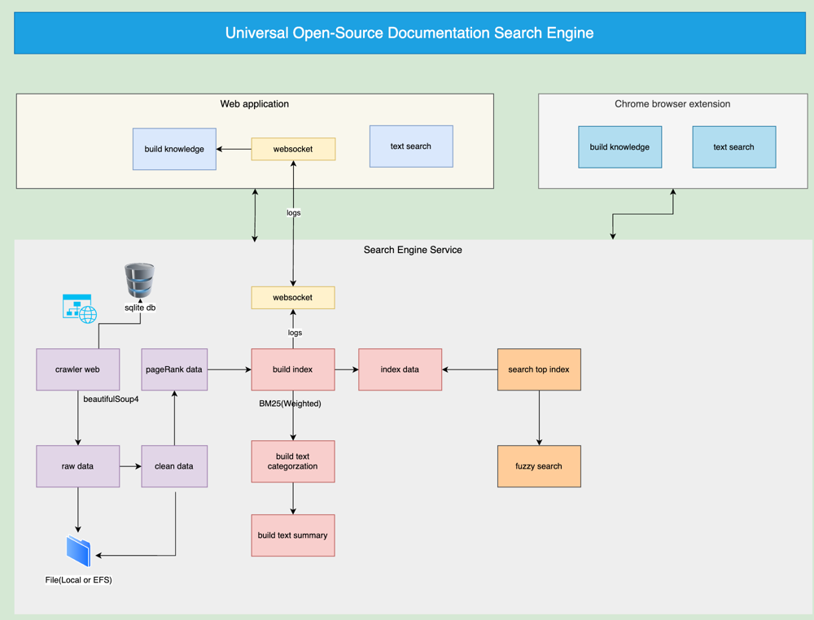

## Installation

### Prerequisites
- Node.js v22+
- Python 3.10+
- Chrome Browser

### Component Setup

#### 1. Backend Setup
```bash
# Clone the backend repository
git clone git@github.com:sherwinwater/search-engine.git
cd search-engine

# Create and activate virtual environment
python -m venv venv
source venv/bin/activate  # On Windows: .\venv\Scripts\activate

# Install dependencies
pip install -r requirements.txt

# Start server
flask --app api/app.py run --port 5009

or
python -m flask --app api/app.py run --port 5009
```

#### 2. Frontend Setup
```bash
# Clone the frontend repository
git clone git@github.com:sherwinwater/text-search.git
cd text-search

# Install dependencies
npm install

# Configure environment
cp .env.example .env
# Edit .env with your configurations

# Start development server
npm start
```

#### 3. Browser Extension Setup
```bash
# Clone the extension repository
git clone git@github.com:sherwinwater/text-search-browser-extension.git
cd text-search-browser-extension
```
Load in Chrome:
1. Open chrome://extensions/
2. Enable "Developer mode"
3. Click "Load unpacked"
4. Select folder's content

## Usage Guide

### Basic Usage Flow
1. Build knowledge by typing documentation URL and click "Build New Knowledge"
   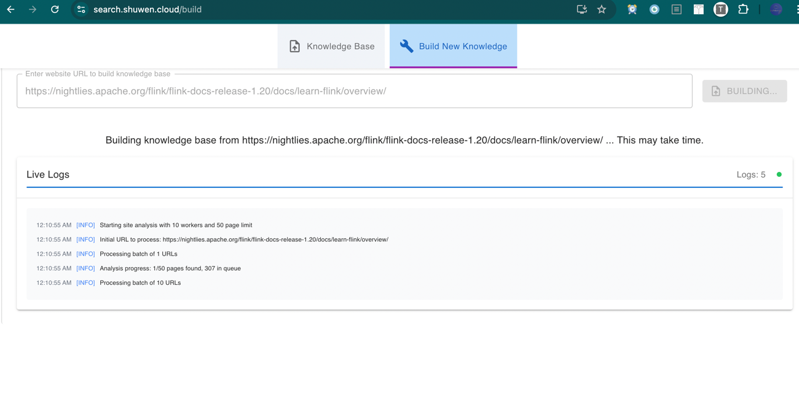
2. Wait for indexing completion
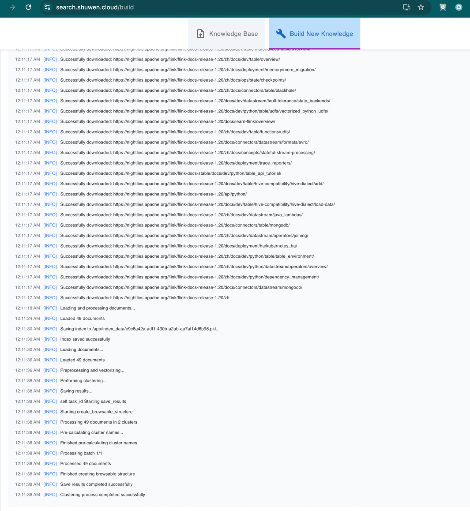
3. View Knowledge Base
3.1 View Knowledge Pages
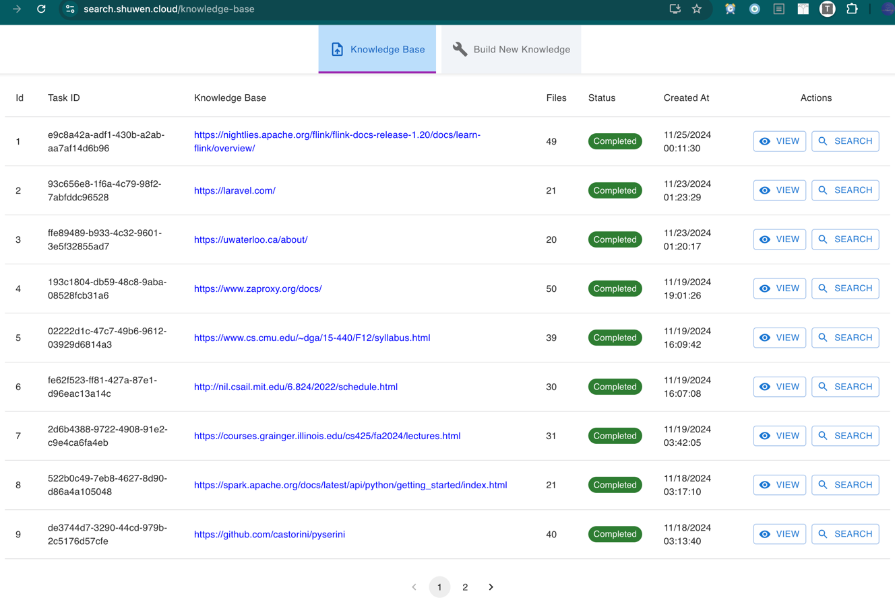
3.2 View Knowledge Page by clicking "View"
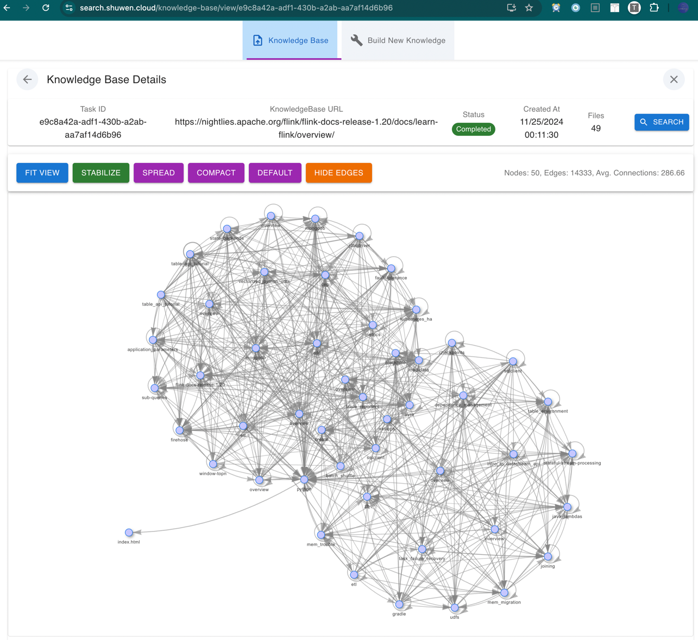
3.2 View Document Clusters
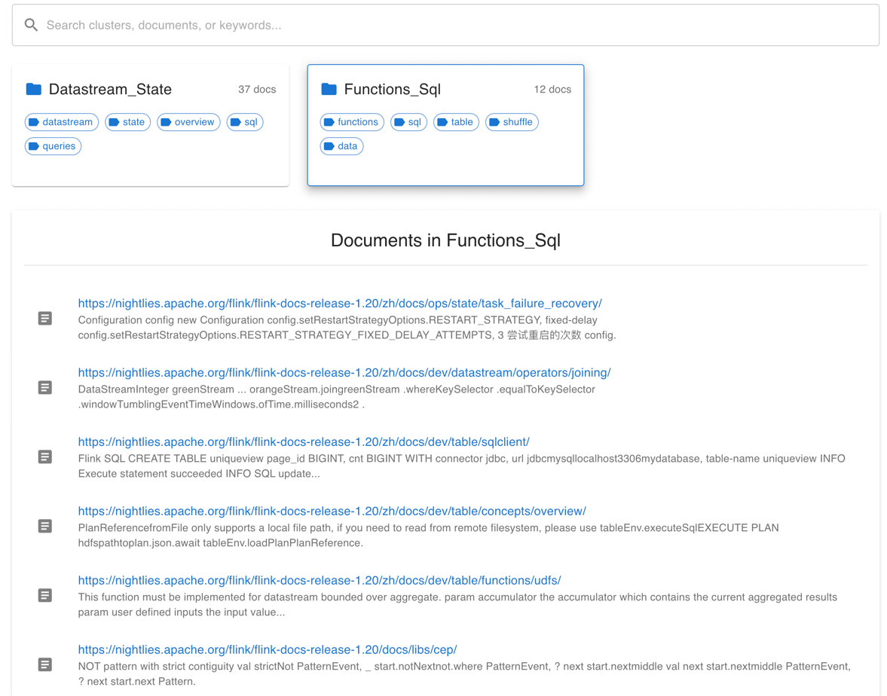
3.3 Search Document Clusters by keyword
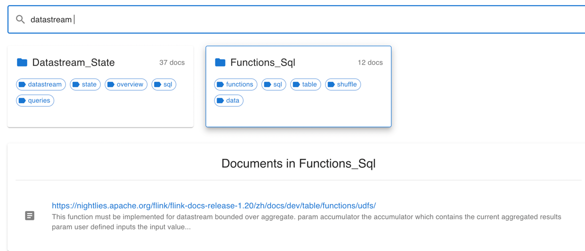
4. Search through documentation
4.1 Clicking "Search" button to open search page
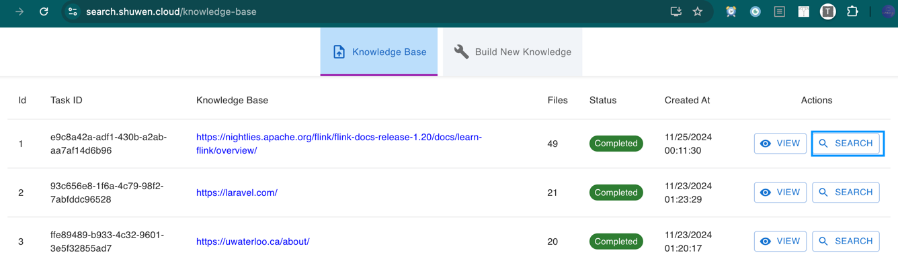
4.2 Enter search query and view results with highlighted relevance
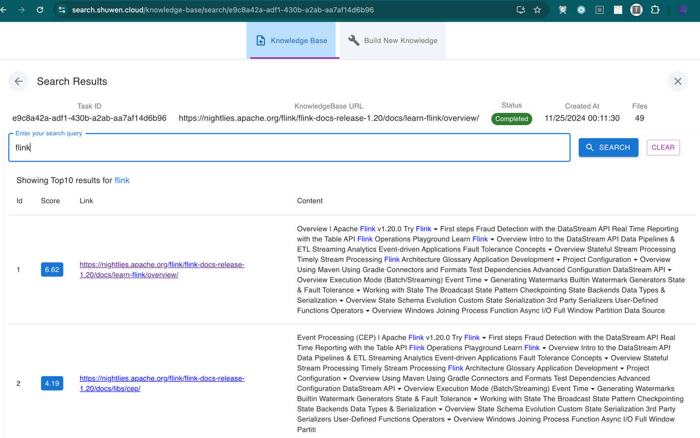

### Advanced Features
- Page graph
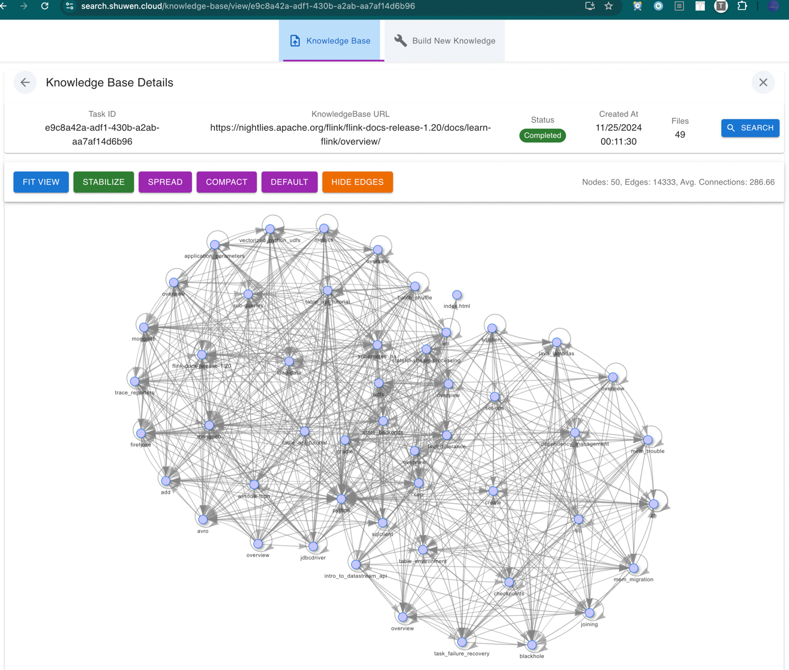
- Content clustering
- Text summarization
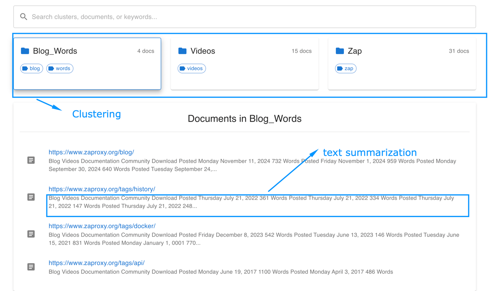
- Fuzzy search
  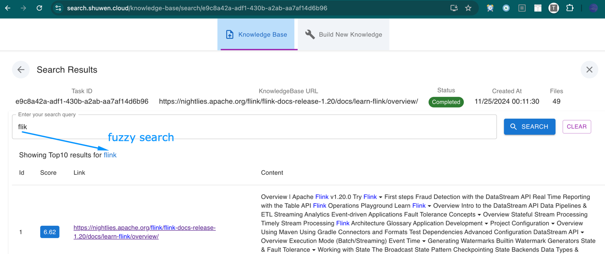
- Browser extension integration

## API Documentation

### Base URL
```
http://localhost:5009
```

### Authentication
No authentication required for basic usage.

### Core Endpoints

#### 1. Start Documentation Indexing
```http
POST /api/build_index_by_url
Content-Type: application/json

{
    "url": "https://docs.example.com",
    "max_pages": 50
}
```

#### 2. Search Documentation
```http
POST /api/search_url
Content-Type: application/json

{
    "url": "https://docs.example.com",
    "query": "search term"
}
```

#### 3. Get Indexing Status
```http
GET /api/clustering_status/{task_id}
```

### WebSocket Events
- `connect`: Client connection
- `join`: Room subscription
- `log_message`: Task updates
- `status`: Status changes


## Frontend Features

### Pages
1. **Home**
   - URL input
   - Recent searches
   - Popular documentation

2. **Search Results**
   - Ranked results
   - Content preview
   - Document clusters

3. **Documentation View**
   - Original content
   - Search highlighting
   - Navigation sidebar

## Browser Extension Features

### Core Features
1. **Quick Search**
   - Keyboard shortcuts
   - Context menu integration
   - Search history

2. **Settings**
   - Default search behavior
   - Results display preferences
   - Custom shortcuts

## Implementation Details

### Technology Stack

#### Backend
- Flask (API Server)
- PostgreSQL (Database)
- Socket.IO (Real-time Updates)
- BM25 (Search Algorithm)

#### Frontend
- React
- Redux (State Management)
- Tailwind CSS
- Socket.IO Client

#### Browser Extension
- React
- Chrome Extension APIs
- Webpack

### Key Components

#### Search Engine
- Document scraping
- Text indexing
- Content clustering
- Relevance ranking

#### Real-time Updates
- WebSocket integration
- Progress tracking
- Status notifications

## Development and Testing

### Testing Strategy
1. **Unit Tests**
   ```bash
   # Backend
   python -m pytest tests/
   
   # Frontend
   npm test
   
   # Extension
   npm test
   ```

2. **Integration Tests**
   ```bash
   pytest tests/integration/
   ```

### Development Workflow
1. Fork repository
2. Create feature branch
3. Implement changes
4. Submit pull request

## Troubleshooting

### Common Issues

#### Indexing Failures
- **Issue**: Timeout during indexing
   - **Solution**: Increase timeout settings or reduce max_pages

- **Issue**: Memory errors
   - **Solution**: Adjust batch size in configuration

#### Search Problems
- **Issue**: No results found
   - **Solution**: Check URL indexing status

- **Issue**: Incorrect results
   - **Solution**: Verify search query format

## Deployment

### Production Setup

#### Backend Deployment
1. Set up production server
2. Configure environment variables
3. Set up process manager
4. Configure NGINX

#### Frontend Deployment
1. Build production bundle
2. Configure CDN
3. Set up hosting

#### Extension Publishing
1. Build production version
2. Create Chrome Web Store listing
3. Submit for review

## License
MIT License