# Universal Open-Source Documentation Search Engine

## Table of Contents
- [Overview](#overview)
- [System Architecture](#system-architecture)
- [Installation](#installation)
- [Usage Guide](#usage-guide)
- [API Documentation](#api-documentation)
- [Frontend Features](#frontend-features)
- [Browser Extension Features](#browser-extension-features)
- [Implementation Details](#implementation-details)
- [Development and Testing](#development-and-testing)
- [Troubleshooting](#troubleshooting)
- [Deployment](#deployment)
- [License](#license)

## Overview
Many open-source libraries lack effective search functionality in their documentation. For example, Apache Storm (version 2.7.0) has no search feature at all, making it difficult for developers to find relevant information quickly. While some documentation sites provide basic search capabilities, they often use simple keyword matching that yields suboptimal results.

Our project aims to develop a universal documentation search engine that can enhance any open-source library's documentation searchability. Users will simply provide the documentation URL, and our system will automatically scrape, index, and make the content searchable using BM25 ranking for improved relevance.

## System Architecture
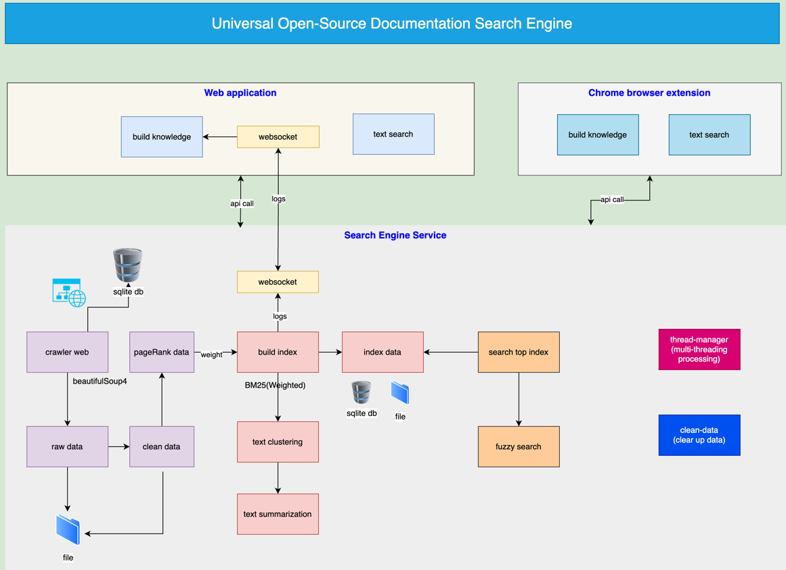

## Application URL and code repos
Applications:
- Web application: https://search.shuwen.cloud
- Chrome browser extension: https://chromewebstore.google.com/detail/text-search/bcdgkbpdkajghkgccekeknalfflfjncd

Code repos:
- Frontend UI: https://github.com/sherwinwater/text-search
- Backend Servcie: https://github.com/sherwinwater/search-engine
- Chrome browser Extension: https://github.com/sherwinwater/text-search-browser-extension

## Installation

### Prerequisites
- Node.js v22+
- Python 3.10+
- Chrome Browser

### Component Setup

#### 1. Backend Setup
```bash
# Clone the backend repository
git clone git@github.com:sherwinwater/search-engine.git
cd search-engine

# Create and activate virtual environment
python -m venv venv
source venv/bin/activate  # On Windows: .\venv\Scripts\activate

# Install dependencies
pip install -r requirements.txt

# Start server
flask --app api/app.py run --port 5009

or
python -m flask --app api/app.py run --port 5009
```

#### 2. Frontend Setup
```bash
# Clone the frontend repository
git clone git@github.com:sherwinwater/text-search.git
cd text-search

# Install dependencies
npm install

# Configure environment
cp .env.example .env
# Edit .env with your configurations

# Start development server
npm start
```

#### 3. Browser Extension Setup
```bash
# Clone the extension repository
git clone git@github.com:sherwinwater/text-search-browser-extension.git
cd text-search-browser-extension
```
Load in Chrome:
1. Open chrome://extensions/
2. Enable "Developer mode"
3. Click "Load unpacked"
4. Select folder's content

## Usage Guide

### Basic Usage Flow
1. Build knowledge by typing documentation URL and click "Build New Knowledge"
   - Enter a valid website URL in the input field
   - Click "Start Building" or press Enter to begin
   - Monitor progress through live logs
   - Option to cancel building or clear results
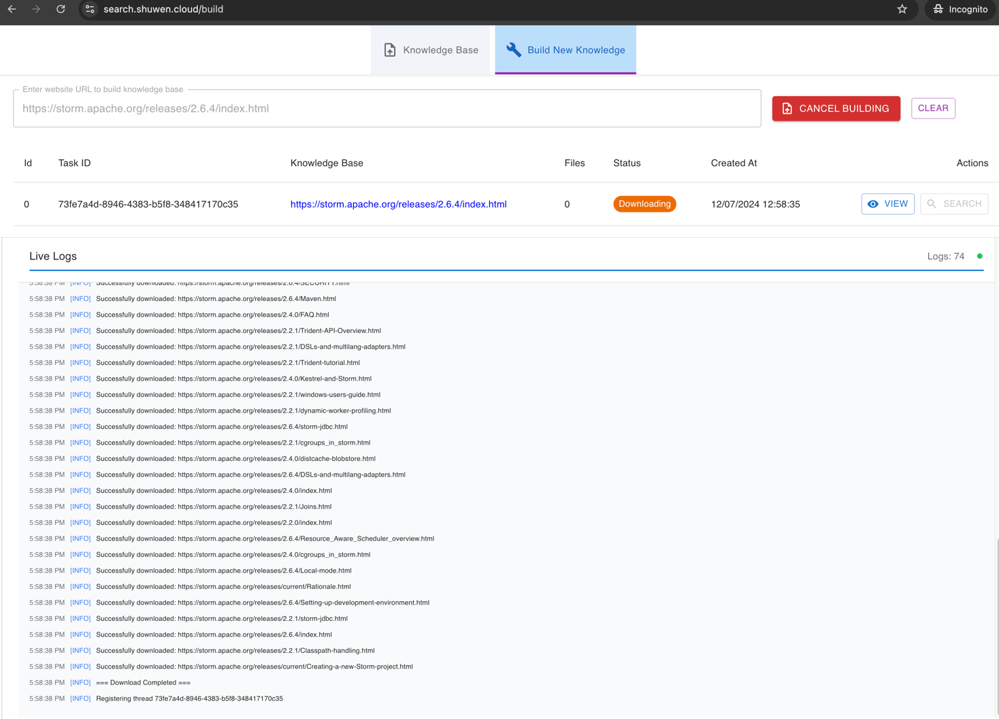
   - 
2. Wait for indexing completion
   - View real-time status updates
   - Monitor processed files count
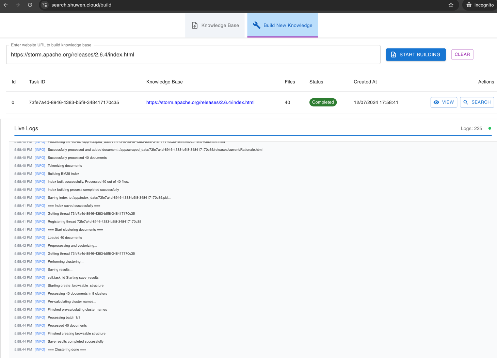
   
3. View Knowledge Base
   3.1 View Knowledge Pages
   - See list of all indexed knowledge bases
   - Each entry shows Task ID, URL, file count, status, and creation time
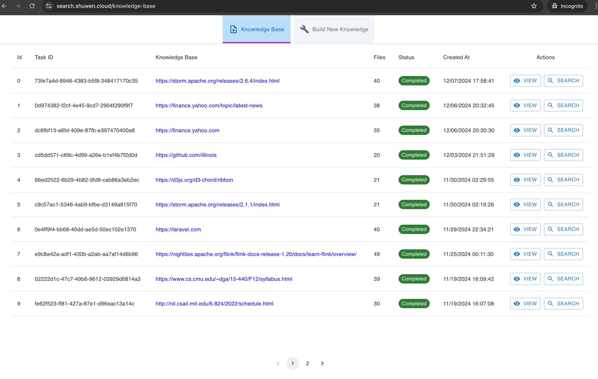
   
   3.2 View Knowledge Page by clicking "View"
   - Access detailed view of indexed content
   - Right-click to open in new tab
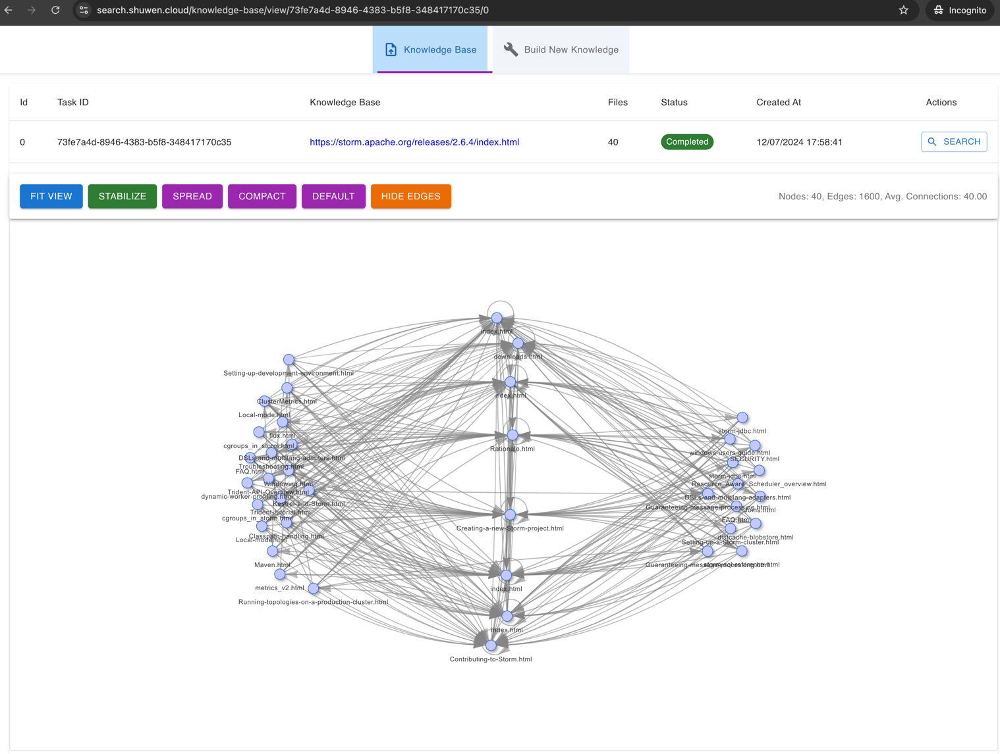
   
   3.3 View Document Clusters
   - Browse clustered content
   - Search through clusters using keywords
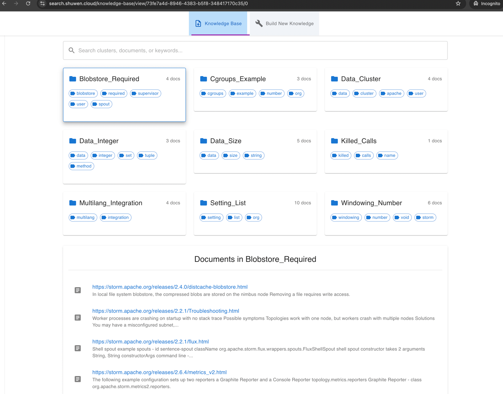
   
   3.4 Search Document Clusters by keyword
   - Filter clusters and documents
   - View matching results
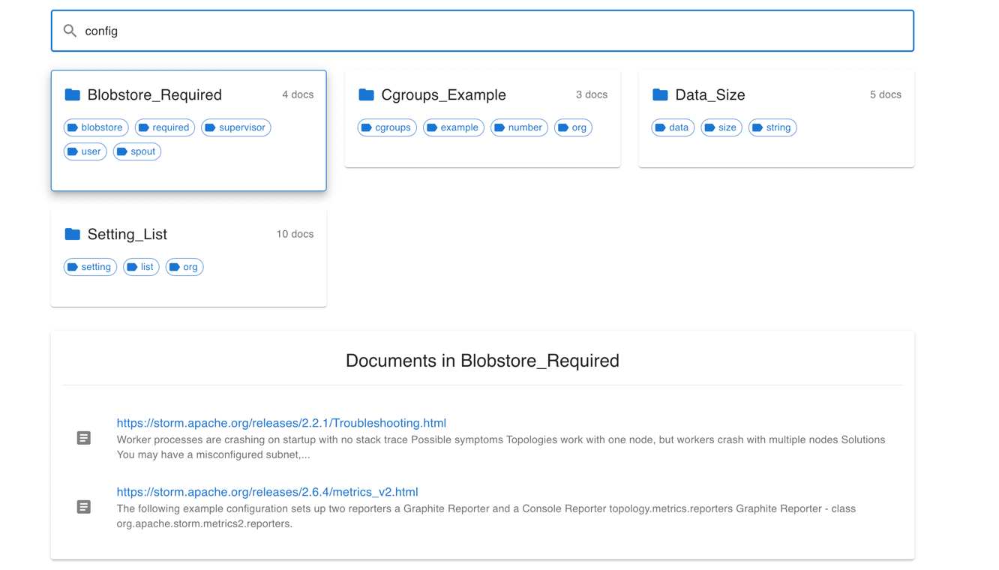
   
4. Search through documentation
   4.1 Click "Search" button to open search page
   - Access search interface
   - Enter search queries
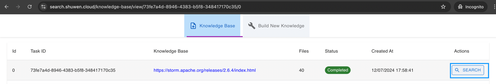
   4.2 Enter search query and view results
   - See relevance scores
   - View highlighted matches in content
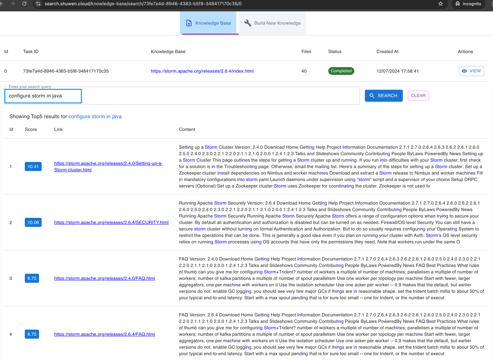

### Advanced Features
- Page graph
  - Interactive network visualization(support spread,compact,default graph view)
  - View page relationships
  - Click node to view page rank, content url link, links, content size,etc.
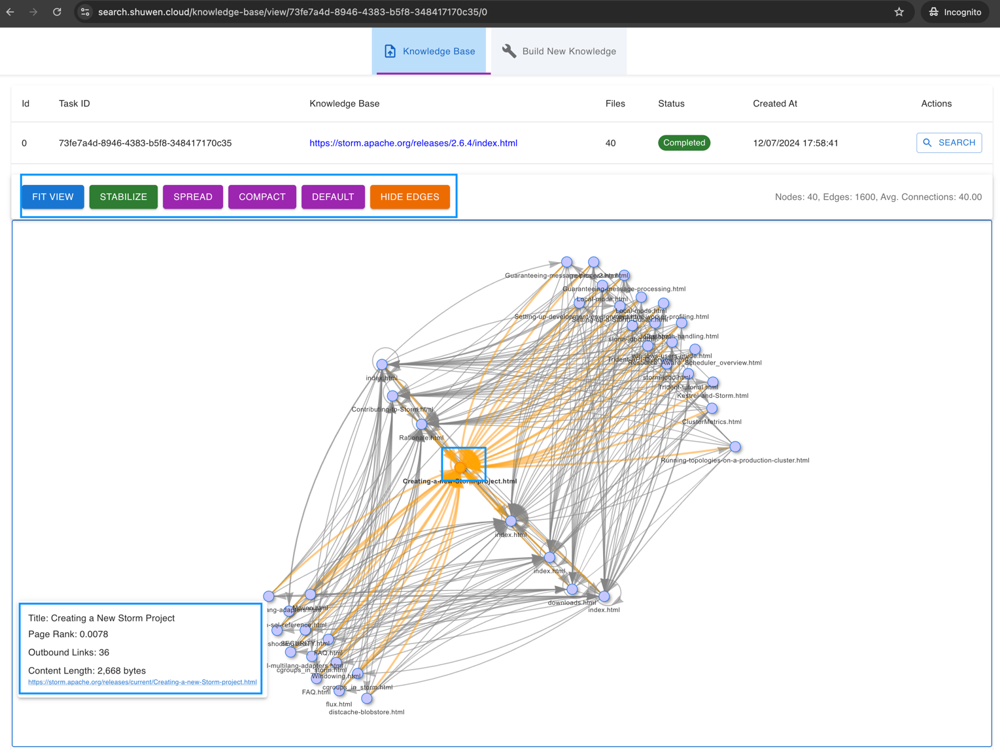
  
- Content clustering
  - View related documents together
  - Browse by clusters
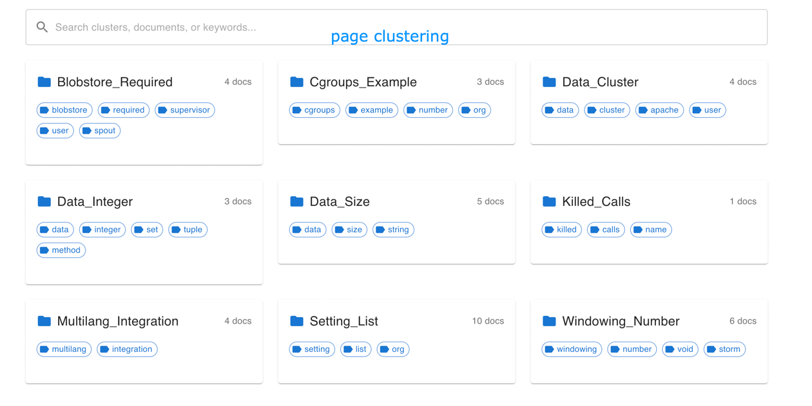
  
- Text summarization
  - View content summaries
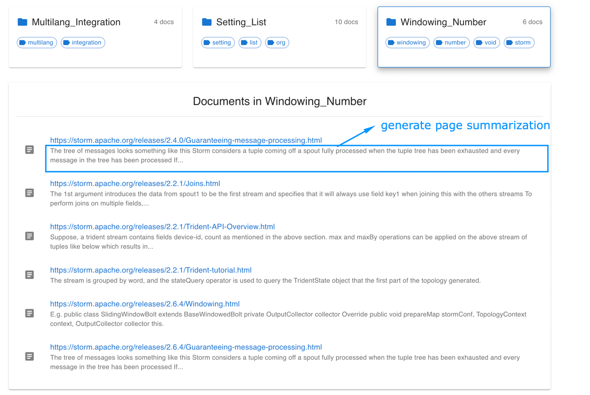
  
- Fuzzy search
  - Handle approximate matches
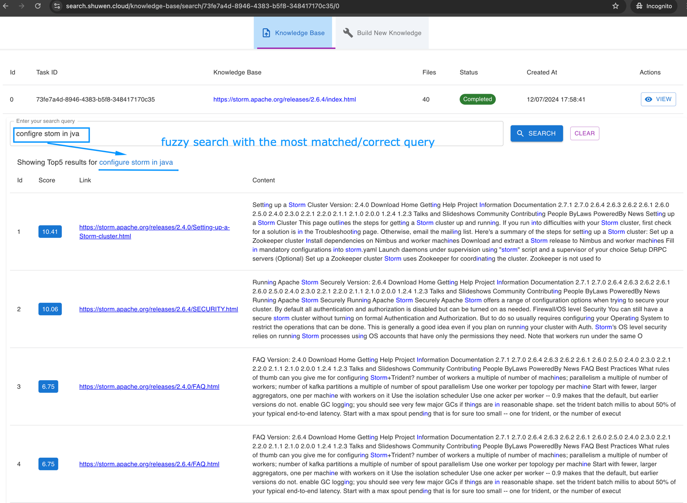
- Browser extension integration
   
## API Documentation
# API Endpoints Overview

| Method | Endpoint | Description | Required Parameters | Response | Notes |
|--------|----------|-------------|-------------------|-----------|--------|
| GET | `/api/scrape_web` | Start web scraping task | `url` (query param), `max_workers` (optional) | Task ID and status endpoint | Initial step for manual scraping |
| GET | `/api/scrape_status/{task_id}` | Check scraping progress | `task_id` (path param) | Scraping status and progress | Includes webpage graph if completed |
| GET | `/api/build_text_index/{task_id}` | Start building text index | `task_id` (path param) | Task ID and build status | Requires completed scraping |
| GET | `/api/text_indexes` | Get all text indexes | None | Array of all index statuses | System-wide index overview |
| GET | `/api/build_text_index_status/{task_id}` | Check index building progress | `task_id` (path param) | Index building status | Monitor index creation |
| POST | `/api/text_index_status_by_url` | Check index status for URL | `url` (body) | Index status for URL | Quick URL status check |
| POST | `/api/build_index_by_url` | Start combined scraping and indexing | `url`, `max_pages` (optional) in body | Task ID and status | **Recommended starting point** |
| GET | `/api/search_text/{task_id}` | Search indexed content | `task_id` (path), `query` (query param) | Search results with scores | Requires completed index |
| POST | `/api/search_url` | Quick search by URL | `url`, `query` in body | Search results | URL must be already indexed |
| POST | `/api/kill/{task_id}` | Cancel running task | `task_id` (path param) | Cancellation status | Stops scraping/indexing |
| DELETE | `/api/text_indexes/{task_id}` | Delete task data | `task_id` (path param) | Deletion status | Removes all task data |
| GET | `/health` | Health check | None | Service status | Basic health check |

## WebSocket Endpoints

| Event | Direction | Parameters | Description |
|-------|-----------|------------|-------------|
| `connect` | Client → Server | None | Initialize WebSocket connection |
| `join` | Client → Server | `task_id` | Join task-specific room |
| `disconnect` | Client → Server | None | Close WebSocket connection |
| `status` | Server → Client | Status message | Real-time task updates |
| `log_message` | Server → Client | Log message | Real-time logging information |

## Common Response Status Codes

| Code | Meaning | Usage |
|------|---------|--------|
| 200 | OK | Successful operation |
| 202 | Accepted | Task started successfully |
| 400 | Bad Request | Missing/invalid parameters |
| 404 | Not Found | Task/Resource not found |
| 500 | Internal Server Error | Server-side error |

## Recommended Flow
1. Start with `/api/build_index_by_url` for new URLs
2. Monitor progress via status endpoints
3. Use `/api/search_text/{task_id}` or `/api/search_url` for searching
4. Use `/api/kill/{task_id}` if needed to stop
5. Clean up with `/api/text_indexes/{task_id}` when done


### Base URL
```
http://localhost:5009
```

### Authentication
No authentication required for basic usage.

### Core Endpoints

#### 1. Start Documentation Indexing
```http
POST /api/build_index_by_url
Content-Type: application/json

{
    "url": "https://docs.example.com",
    "max_pages": 50
}
```

#### 2. Search Documentation
```http
POST /api/search_url
Content-Type: application/json

{
    "url": "https://docs.example.com",
    "query": "search term"
}
```

#### 3. Get Indexing Status
```http
GET /api/clustering_status/{task_id}
```

### WebSocket Events
- `connect`: Client connection
- `join`: Room subscription
- `log_message`: Task updates
- `status`: Status changes


## Frontend Features

### Pages
1. **Home**
   - URL input
   - Recent searches
   - Popular documentation

2. **Search Results**
   - Ranked results
   - Content preview
   - Document clusters

3. **Documentation View**
   - Original content
   - Search highlighting
   - Navigation sidebar

## Browser Extension Features

### Core Features
1. **Quick Search**
   - Keyboard shortcuts
   - Context menu integration
   - Search history

2. **Settings**
   - Default search behavior
   - Results display preferences
   - Custom shortcuts

## Implementation Details

### Backend
- Flask (API Server)
- sqlite (Database)
- Socket.IO (Real-time Updates)
- BM25 (Search Algorithm)
- Key Components: HTMLScraper, Text Indexing, Clustering, Summarization, Fuzzy Search

### HTMLScraper

#### Overview
The HTMLScraper is a custom-built web scraping tool designed to systematically explore and download web pages from a specified website. It's implemented as a Python class that handles URL parsing, content downloading, link extraction, and task status management.

#### Key Features
- Recursive web crawling
- Concurrent page downloads
- Link extraction and graph building
- Progress tracking and status reporting
- Error handling and retry mechanisms

#### Implementation

The HTMLScraper is implemented as a Python class, utilizing several built-in and third-party libraries:

1. **Core Libraries**:
   - `requests`: For making HTTP requests to web pages
   - `BeautifulSoup` (from `bs4`): For parsing HTML content and extracting links
   - `urllib`: For URL parsing and manipulation

2. **Concurrency**:
   - `concurrent.futures`: For managing concurrent downloads

3. **File and Path Handling**:
   - `os`: For file system operations
   - `pathlib`: For cross-platform path handling

4. **Data Management**:
   - `json`: For storing and manipulating graph data

5. **Utilities**:
   - `time`: For timing operations
   - `uuid`: For generating unique identifiers
   - Custom logging module: For logging scraper activities

#### Key Components

1. **Initialization**:
   - Sets up initial parameters, including base URL, output directory, and task ID
   - Initializes data structures for tracking visited URLs and downloaded files

2. **Site Analysis**:
   - Recursively crawls the website, starting from the base URL
   - Extracts and validates links from each page
   - Builds a graph representation of the site structure

3. **Page Download**:
   - Downloads pages concurrently using a thread pool
   - Saves HTML content to the specified output directory
   - Handles retries for failed downloads

4. **Status Management**:
   - Maintains a detailed status dictionary
   - Updates progress metrics like pages found, download counts, and timing information
   - Interfaces with a database to persist task status

5. **Graph Building**:
   - Constructs a graph of web pages and their links
   - Saves the graph structure to a JSON file for later analysis

### BuildTextIndex 

#### Overview
`BuildTextIndex` is a Python class designed to create and manage a searchable index of text documents. It processes various document types (HTML, PDF) from a specified directory, extracts their content, and builds a searchable index using the BM25 algorithm.

#### Key Features
- Document processing (HTML and PDF)
- Text extraction and cleaning
- Index building using BM25 algorithm
- Persistent storage of the index
- Status tracking and reporting

#### Implementation

The `BuildTextIndex` class is implemented using several Python libraries:

1. **Core Libraries**:
   - `os`, `pathlib`: For file and directory operations
   - `datetime`: For timestamp management
   - `json`: For data serialization
   - `pickle`: For object serialization and index storage

2. **Text Processing**:
   - `BeautifulSoup` (from `bs4`): For HTML parsing
   - `PyPDF2`: For PDF content extraction
   - `re`: For regular expression operations in text cleaning

3. **Indexing**:
   - `rank_bm25`: For implementing the BM25 ranking algorithm
   - Custom `BM25OkapiWeighted`: A modified version of BM25
      - Extends standard BM25 algorithm with document weighting
      - Allows for more flexible and nuanced document scoring

     Key Features:
      1. Document Weighting:
         - Incorporates weight factor for each document in corpus
         - Enables boosting or penalizing specific documents in final ranking

      2. IDF Calculation with Floor Value:
         - Implements minimum IDF value for better handling of rare terms
         - Uses epsilon parameter to set floor as fraction of average IDF

      3. Customizable Parameters:
         - k1: Controls term frequency saturation
         - b: Determines impact of document length normalization
         - epsilon: Sets floor for IDF values

      4. Vectorized Operations:
         - Utilizes NumPy for efficient array operations
         - Improves performance on large corpora

4. **Utilities**:
   - `tqdm`: For progress bars
   - Custom logging module: For logging indexing activities

5. **Data Management**:
   - Custom `SearchEngineDatabase`: For storing and retrieving index metadata

#### Key Components

1. **Initialization**:
   - Sets up parameters like document directory, task ID, and index paths
   - Initializes data structures for documents and the BM25 index

2. **Document Processing**:
   - Walks through the specified directory to find HTML and PDF files
   - Extracts text content from these files
   - Cleans and tokenizes the extracted text

3. **Index Building**:
   - Creates a BM25 index from the processed documents
   - Assigns rank scores to documents based on various factors

4. **Persistence**:
   - Saves the built index to disk using pickle serialization
   - Stores metadata about the index in a database

5. **Status Management**:
   - Tracks the progress of index building
   - Updates status information in the database

   
### DocumentClustering

#### Overview
The `DocumentClustering` class is designed to perform clustering analysis on a collection of documents. It processes various document types, extracts features, and applies clustering algorithms to group similar documents together.

#### Key Features
- Document processing (HTML, PDF, and potentially other formats)
- Text extraction and preprocessing
- Feature vectorization using TF-IDF and Word2Vec
- Clustering using K-means algorithm
- Cluster analysis and summarization
- Progress tracking and status reporting

#### Implementation

The `DocumentClustering` class is implemented using several Python libraries:

1. **Core Libraries**:
   - `os`, `pathlib`: For file and directory operations
   - `numpy`: For numerical computations
   - `pandas`: For data manipulation and analysis

2. **Text Processing**:
   - `BeautifulSoup` (from `bs4`): For HTML parsing
   - `PyPDF2`: For PDF content extraction
   - `re`: For regular expression operations in text cleaning

3. **Machine Learning and NLP**:
   - `sklearn.cluster`: For K-means clustering
   - `sklearn.metrics`: For silhouette score calculation
   - `gensim.models`: For Word2Vec model implementation

4. **Data Serialization**:
   - `json`: For storing and manipulating structured data
   - `pickle`: For object serialization

5. **Utilities**:
   - Custom logging module: For logging clustering activities
   - `datetime`: For timestamp management

6. **Text Summarization**:
   - Custom `TextSummarizer`: For generating summaries of clustered documents

#### Key Components

1. **Initialization**:
   - Sets up parameters like folder path, task ID, and URL mapping
   - Initializes data structures for documents and vectors

2. **Document Processing**:
   - Loads documents from the specified folder
   - Extracts text content from various file formats
   - Cleans and preprocesses the extracted text

3. **Feature Extraction**:
   - Implements TF-IDF vectorization for document representation
   - Optionally uses Word2Vec for semantic feature extraction

4. **Clustering**:
   - Applies K-means algorithm to group similar documents
   - Determines optimal number of clusters using silhouette score

5. **Analysis and Summarization**:
   - Generates summaries for each cluster
   - Creates a structured representation of clustering results

6. **Persistence**:
   - Saves clustering results and analysis to files
   - Stores metadata about the clustering task

   
### TextSummarizer

#### Overview
The `TextSummarizer` class is designed to generate concise summaries of text documents. It employs natural language processing techniques to extract key sentences and produce a condensed version of the input text while preserving its main ideas and context.

#### Key Features
- Text preprocessing and cleaning
- Sentence tokenization and scoring
- Extractive summarization
- Customizable summary length
- Support for multiple summarization algorithms

#### Implementation

The `TextSummarizer` class is implemented using several Python libraries:

1. **Core Libraries**:
   - `re`: For text cleaning and regular expression operations
   - `heapq`: For efficient selection of top-scoring sentences

2. **Natural Language Processing**:
   - `nltk`: For sentence tokenization and stop word removal
   - `spacy`: For advanced linguistic analysis (optional)

3. **Text Processing**:
   - Custom text cleaning functions
   - Sentence scoring algorithms

4. **Summarization Algorithms**:
   - Frequency-based summarization
   - TextRank algorithm implementation
   - Latent Semantic Analysis (LSA) summarization (optional)

5. **Utilities**:
   - Custom logging module: For tracking summarization process
   - Error handling for input validation

#### Key Components

1. **Initialization**:
   - Sets up parameters like desired summary length and algorithm choice
   - Initializes NLP tools and resources (e.g., stop words list)

2. **Text Preprocessing**:
   - Cleans input text (remove special characters, convert to lowercase, etc.)
   - Tokenizes text into sentences

3. **Sentence Scoring**:
   - Implements various scoring methods (e.g., word frequency, sentence position)
   - Calculates importance score for each sentence

4. **Summary Generation**:
   - Selects top-scoring sentences based on desired summary length
   - Reorders selected sentences to maintain original text flow

5. **Algorithm Implementations**:
   - Frequency-based summarization
   - TextRank algorithm for graph-based summarization
   - Optional advanced algorithms like LSA

   
### TextSearch 

#### Overview
The `TextSearch` class is designed to perform efficient text search operations on a collection of documents. It employs various indexing techniques and search algorithms to quickly locate relevant documents based on user queries, including support for fuzzy search.

#### Key Features
- Document indexing using TF-IDF and BM25
- Support for multiple search algorithms (e.g., Boolean, Vector Space)
- Fuzzy search capability for handling typos and near-matches
- Query parsing and preprocessing
- Document ranking and scoring
- Customizable search parameters (e.g., relevance threshold, result limit, fuzziness level)

#### Implementation

The `TextSearch` class is implemented using several Python libraries:

1. **Core Libraries**:
   - `os`, `pathlib`: For file system operations
   - `numpy`: For numerical computations
   - `pandas`: For data manipulation and analysis

2. **Text Processing**:
   - `nltk`: For text tokenization and stop word removal
   - `re`: For regular expression operations

3. **Indexing and Search**:
   - `sklearn.feature_extraction.text`: For TF-IDF vectorization
   - `rank_bm25`: For BM25 indexing and search
   - Custom search algorithms (e.g., Boolean, Vector Space)

4. **Fuzzy Search**:
   - `fuzzywuzzy`: For fuzzy string matching
   - `python-Levenshtein`: For efficient Levenshtein distance calculation

5. **Utilities**:
   - Custom logging module: For tracking search process
   - Error handling for input validation

#### Key Components

1. **Initialization**:
   - Sets up parameters like index type, search algorithm, relevance threshold, and fuzziness level
   - Initializes indexing and search tools

2. **Document Indexing**:
   - Creates TF-IDF or BM25 index of documents
   - Stores index in memory or on disk

3. **Query Preprocessing**:
   - Tokenizes and preprocesses user query
   - Removes stop words and special characters

4. **Search Algorithm**:
   - Implements Boolean, Vector Space, or other search algorithms
   - Incorporates fuzzy matching for query terms
   - Scores documents based on query relevance and fuzzy match quality

5. **Fuzzy Matching**:
   - Applies fuzzy string matching to handle typos and near-matches
   - Adjusts relevance scores based on fuzzy match quality

6. **Document Ranking**:
   - Ranks documents by relevance score, incorporating fuzzy match results
   - Returns top-scoring documents

7. **Result Processing**:
   - Formats search results for user display
   - Includes document metadata (e.g., title, author)
   - Highlights fuzzy-matched terms in results

   
### Frontend Implementation

- **React**: Used for building the main web application interface
- **Material-UI (MUI)**: Provides pre-built components and styling for consistent UI design
- **Socket.IO Client**: Enables real-time updates and progress monitoring
- **Page Graph Network**: Visualizes webpage graph structure using vis-network library

#### 1. Real-time Building Knowledge Progress Monitoring
- WebSocket integration for live task status updates
- Real-time progress bars for scraping and indexing tasks
- Live log streaming for debugging and monitoring

#### 2. Search Interface
- Result highlighting and scoring visualization

#### 3. Task Management Dashboard
- Overview of all running and completed tasks
- Task status monitoring and control
- Ability to start, stop, and delete tasks
- Visual representation of webpage graphs
- Pagination

#### 4. API Integration
- Integrated endpoints for scraping, indexing, and searching
- Error handling and retry mechanisms
- Progress tracking and status updates
- WebSocket subscription management


### Browser Extension Implementation

- **JavaScript**: Core extension functionality

#### 1. Build Knowledge
- Building knowledge by scraping and indexing webpages

#### 2. Search Interface
- By calling API endpoints from the search box
- Showing search results

## Development
### Development Workflow
1. Fork repository
2. Create feature branch
3. Implement changes
4. Submit pull request

## Troubleshooting

### Common Issues

#### Indexing Failures
- **Issue**: Timeout during indexing
   - **Solution**: Retry indexing

#### Search Problems
- **Issue**: No results found
   - **Solution**: Check query spelling and indexing status


## Deployment

### Production Setup

#### Backend Deployment
1. Set up production server
2. Configure environment variables
3. Set up process manager

#### Frontend Deployment
1. Build production bundle
3. Set up hosting

#### Extension Publishing
1. Build production version
2. Create Chrome Web Store listing
3. Submit for review

## License
MIT License